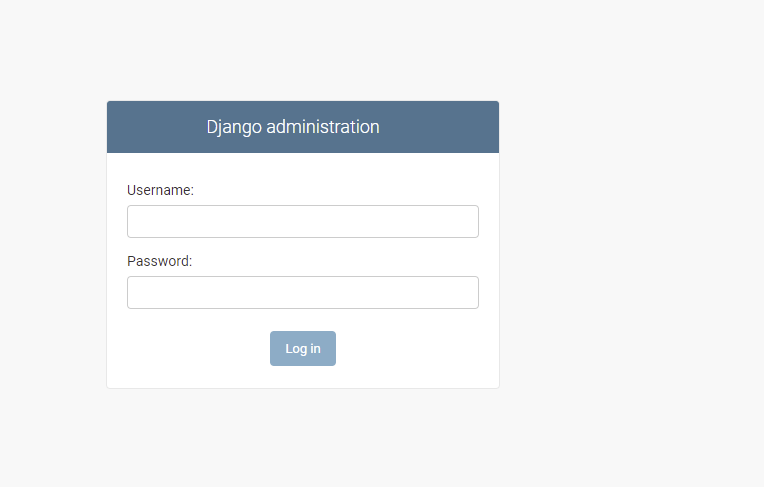
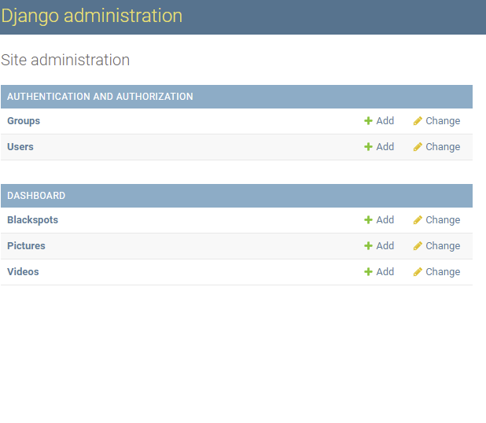
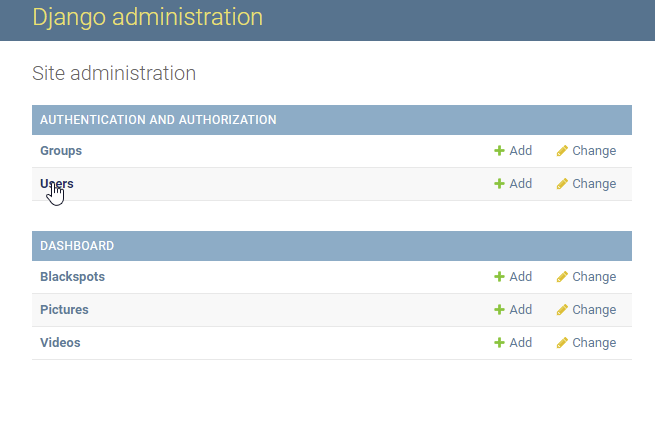
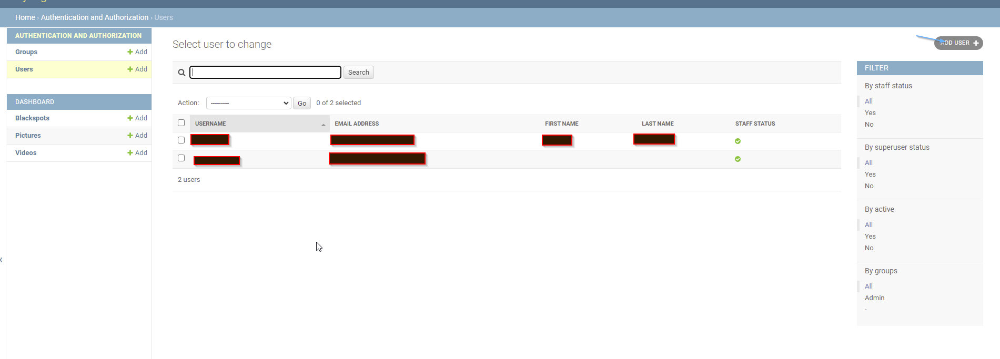
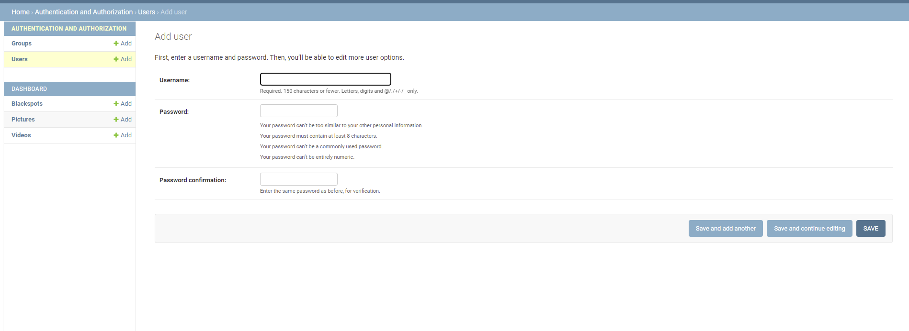
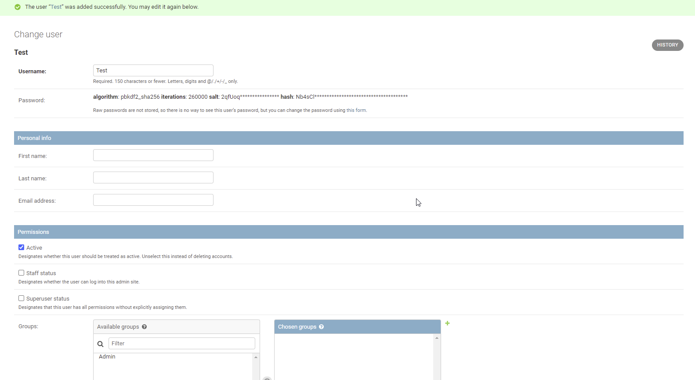
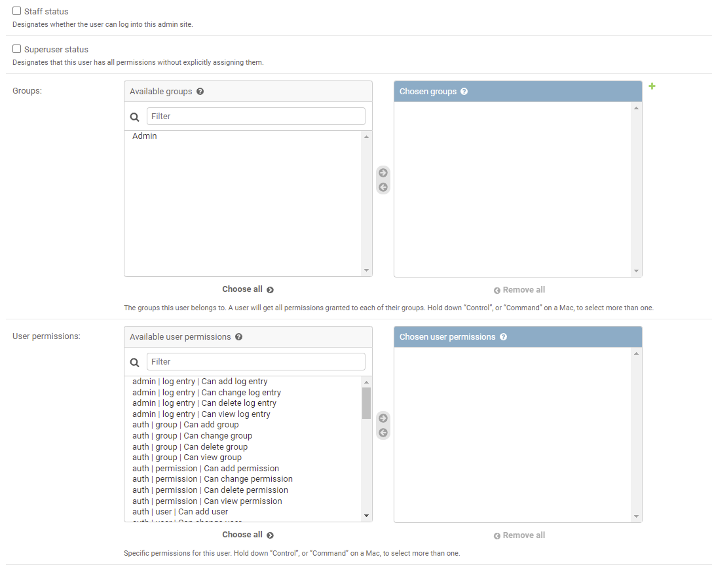

######################
Background Information
######################

This project encompases visualization of Road Blackspot in the five counties that
were visited in a web portal. This documentation is to help the system admininstrators to maintain current and 
subsequent versions of the platform. 

#####################
Project Implemetation
#####################

The project was Implemetated by St. Johns Ambulance

Tech Stack
----------
Tech stack means the technologies used in the development of the GIS enabled web portal (Geoportal)

The system encompases of two segments the back-end and the frontend;

* The back-end of the system stores and manipilates data 

* While the front end of the system is meant to visualize the data

The Backend which this manual will be more focused on, was Implemetated using python language using the Django Framework.

The Frontend on the other hand was implemented using JavaScript language using the Vue Framework. 

System Administration
---------------------

This section highlights processes and tasks that a system admininstrator may undertake. 
The tasks entail updating datasets and in some instances editing datasets. 

**************************************
Accessing the system  as an Admin user
**************************************

In order to perform administrative tasks one has to access the system from the admin page. 

Login Credentials shall be shared and one can use this to gain access to the system. 

As at now the system admin page can be found by clicking `Crash Dashboard Admin`_.

*******************************
Adding users and Managing users
*******************************  

Adding users with super user status can be done in two ways.

i. In the server through the terminal by exceution of commands

ii. Through the dashboard admin page `Crash Dashboard Admin`_.

Instructions on how to access the server will be given on a separate forum to be agreed.

Adding user from the Admin dashboard is pretty easy the following steps are followed to do so:

a. log into the dashboard 

b. click on the users tab

c. Add the user information and save

**Giving the user additional information and super user status**

You may add additional information for the user for instance;

* First name 

* Last name 

* Email address

Give the user active status by clicking the staff status and Super user status. This 
allows the user to access the admin dashboard. 

***************************
Managing what a user can do 
***************************

You can limit what users can do by creating user groups and adding users to the group or just by adding user permmisions for 
each user.

Adding user permmisions in groups will help in whether a user can add, delete or modify data. 

.. _Crash Dashboard Admin: http://45.63.48.25:8080/admin/